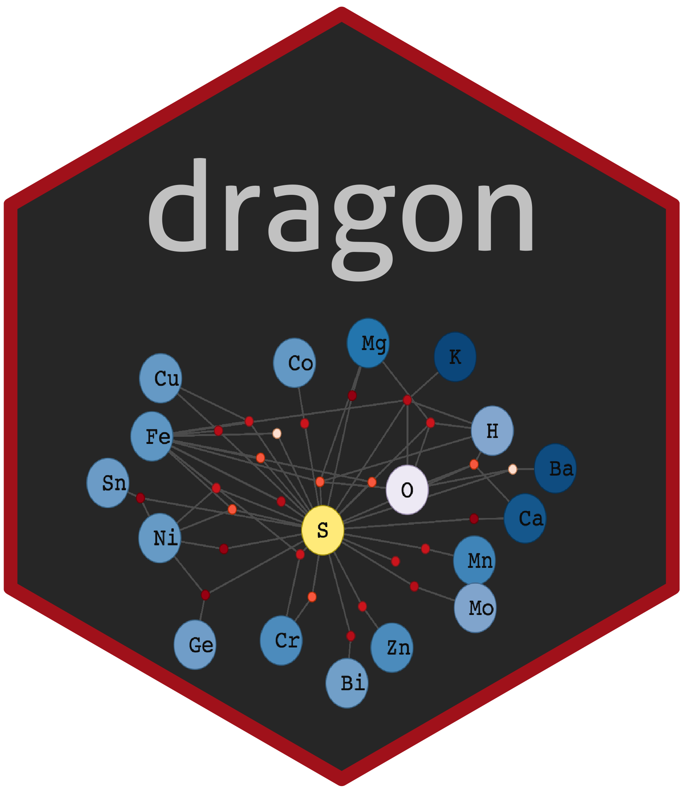

# DRAGON  




[](https://travis-ci.org/spielmanlab/dragon) 


The `dragon` (**D**eep time **R**edox **A**nalysis of the **G**eobiology **O**ntology **N**etwork) package provides a [Shiny Application](https://shiny.rstudio.com/) for generating, exploring, and analyzing bipartite mineral-chemistry networks over deep time on Earth using information from the [Mineral Evolution Database](http://rruff.info/ima/), with a specific application of investigating biologically-relevant evolution of element redox states and availability over time. `dragon` uses `igraph` and `visNetwork` library (a terribly handy R wrapper for `vis.js`) to construct user-friendly interactive networks. 

This package was written by Stephanie J. Spielman, Ph.D. at Rowan University for collaborative research with Eli K. Moore, Ph.D. at Rowan University and is licensed under GPL-3.

To obtain and run `dragon`, you will need the `remotes` package:

```
## Install dragon 
library(remotes)
install_github("spielmanlab/dragon", force=T) ## recommended to add `force` argument to ensure the most up-to-date dragon version!

## Load dragon and launch shiny application
library(dragon)
rundragon()
```

Alternatively, `dragon` is freely hosted at [https://sjspielman.shinyapps.io/dragon/](https://sjspielman.shinyapps.io/dragon/).

Additional documentation for `dragon` use is forthcoming. 
