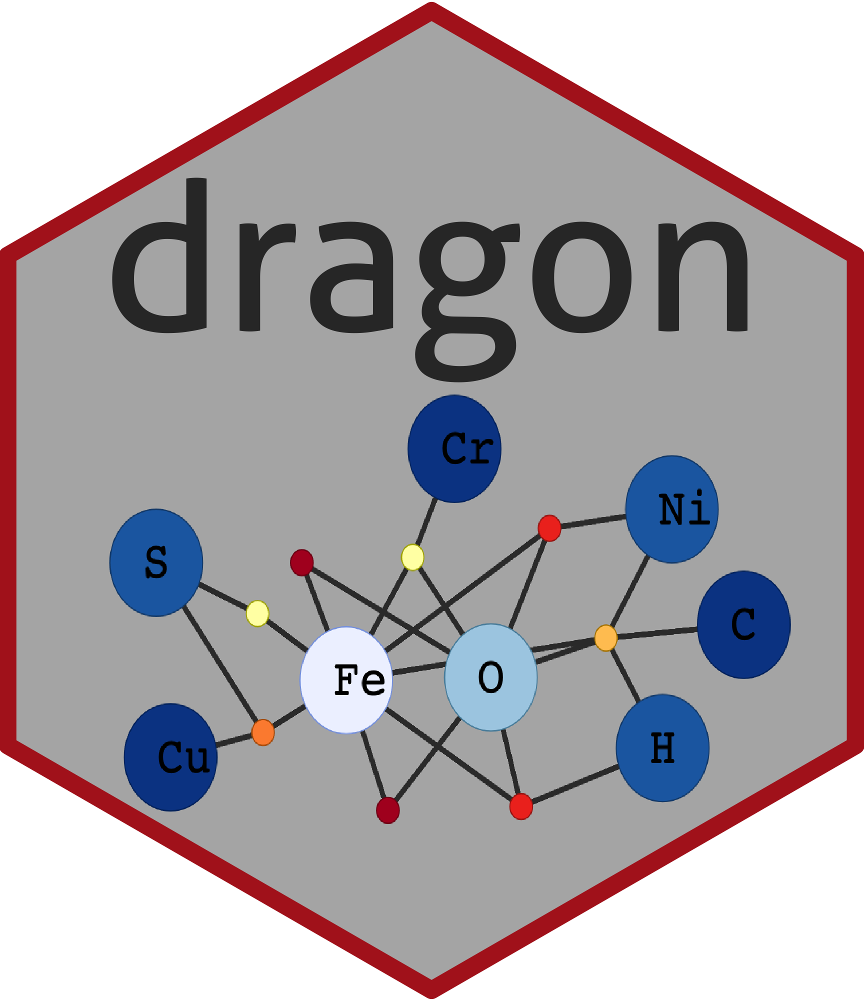

# dragon

[](https://www.tidyverse.org/lifecycle/#stable) 
[](https://travis-ci.org/sjspielman/dragon)
[](https://CRAN.R-project.org/package=dragon)
**The current version is 1.0.3.**





The `dragon` (**D**eep time **R**edox **A**nalysis of the **G**eobiology **O**ntology **N**etwork) package provides a [Shiny Application](https://shiny.rstudio.com/) for generating, exploring, and analyzing bipartite mineral-chemistry networks over deep time on Earth using information from the [Mineral Evolution Database](https://rruff.info/ima/), with a specific application of investigating biologically-relevant evolution of element redox states and availability over time. `dragon` uses `igraph` and `visNetwork` library (a terribly handy R wrapper for `vis.js`) to construct user-friendly interactive networks. 

**The associated publication** is available [here](https://doi.org/10.3389/feart.2020.585087) and can be cited as:

Spielman, Stephanie J. and Moore, Eli K. 2020. “dragon: A New Tool for Exploring Redox Evolution Preserved in the Mineral Record.” *Frontiers in Earth Science*. doi:10.3389/feart.2020.585087.

Or, in LaTeX:
```
@article{  ,
  author  = {Spielman, Stephanie J. and Moore, Eli K.},   
  title   = {dragon: A New Tool for Exploring Redox Evolution Preserved in the Mineral Record},      
	journal = {Frontiers in Earth Science},      
	volume  = {8},    
	pages   = {414},
	year    = {2020},
	doi     = {10.3389/feart.2020.585087}
}
```

**For instructions on obtaining and using dragon**, please see the [vignette](http://htmlpreview.github.io/?https://github.com/sjspielman/dragon/blob/master/doc/dragon.html).

**Current link to server of current release of dragon:** [https://sjspielman.shinyapps.io/dragon](https://sjspielman.shinyapps.io/dragon)


**Current link to server of development version of dragon:** [https://sjspielman.shinyapps.io/dragon-dev](https://sjspielman.shinyapps.io/dragon-dev)


