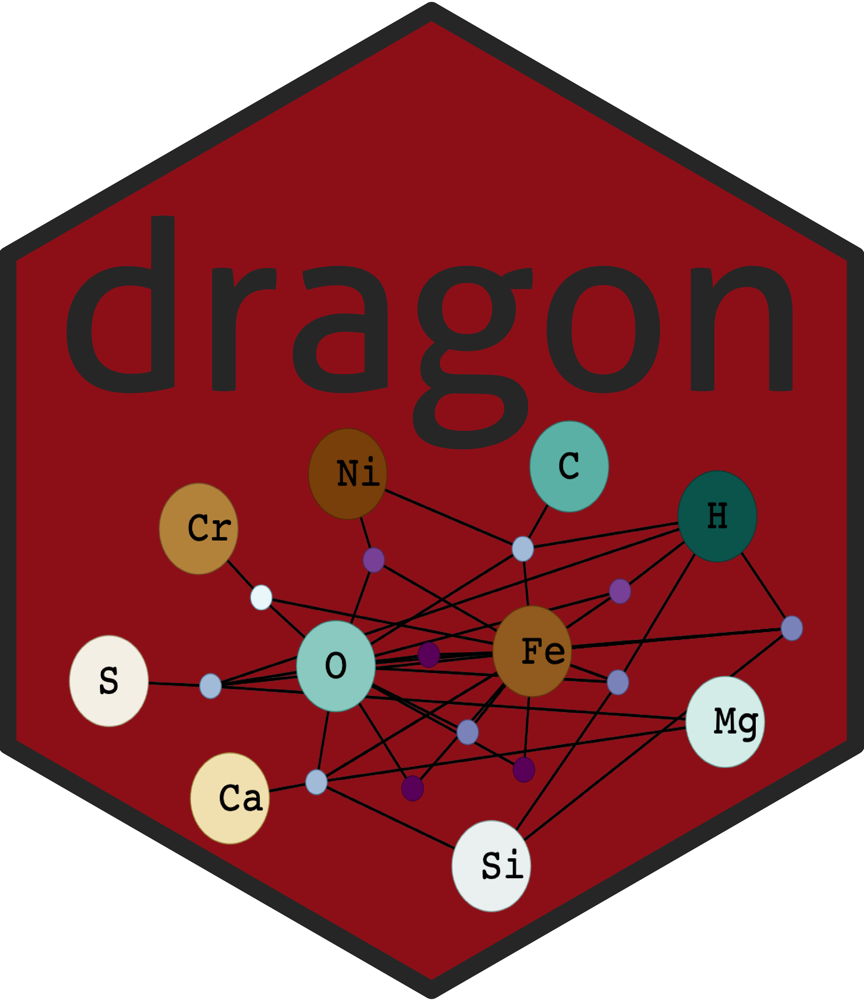

# dragon

  

**The current version of dragon is `1.0.0`.**

The `dragon` (**D**eep time **R**edox **A**nalysis of the **G**eobiology **O**ntology **N**etwork) package provides a [Shiny Application](https://shiny.rstudio.com/) for generating, exploring, and analyzing bipartite mineral-chemistry networks over deep time on Earth using information from the [Mineral Evolution Database](http://rruff.info/ima/), with a specific application of investigating biologically-relevant evolution of element redox states and availability over time. `dragon` uses `igraph` and `visNetwork` library (a terribly handy R wrapper for `vis.js`) to construct user-friendly interactive networks. 

**Citation forthcoming.**

**For instructions on obtaining and using dragon**, please see the [vignette](http://htmlpreview.github.io/?https://github.com/sjspielman/dragon/blob/dev/vignettes/dragon.html).

**Current link to server:** [sjspielman.shinyapps.io/dragon-dev](sjspielman.shinyapps.io/dragon-dev)

